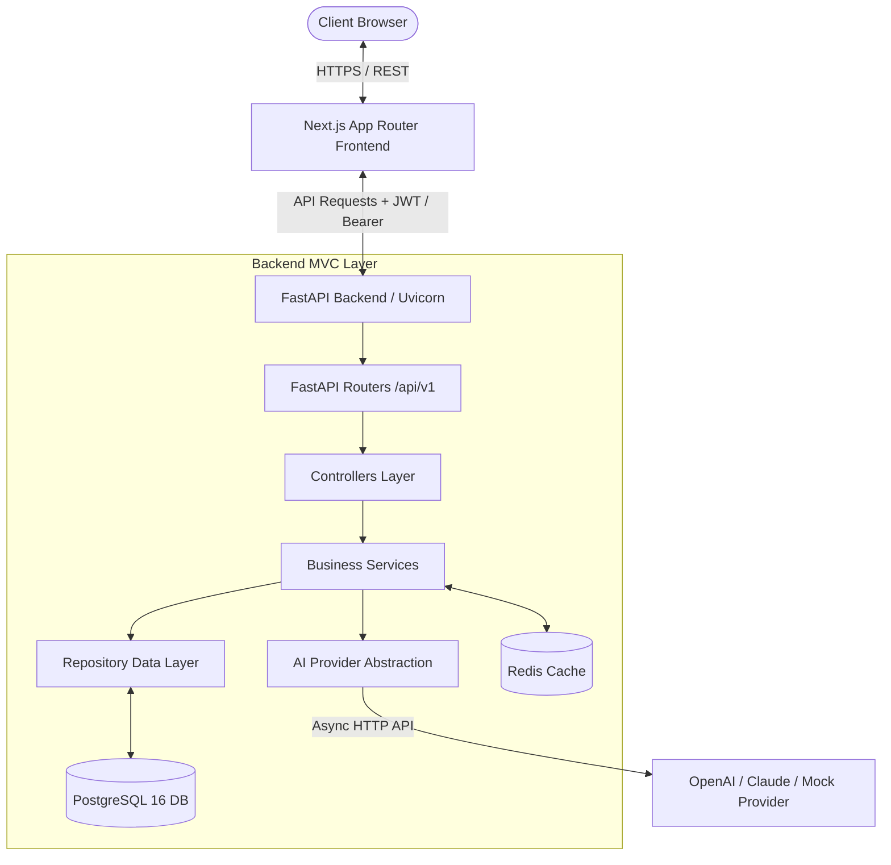
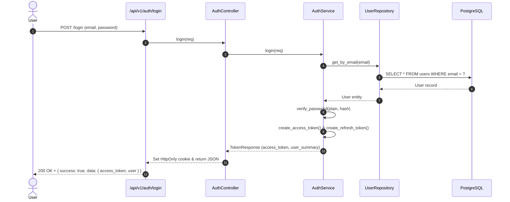
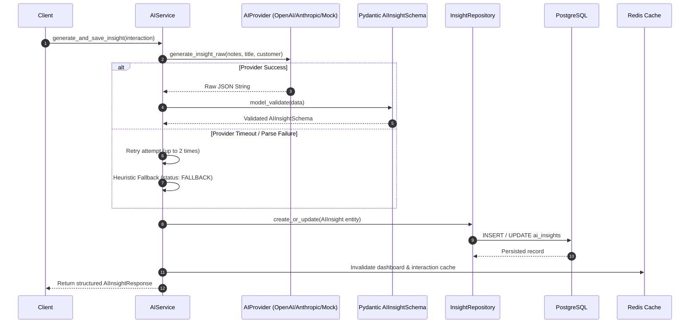

# System Architecture & Technical Design

This document details the architectural principles, layer separation, request lifecycles, and data flows of the **AI-Powered Customer Success Platform**.

---

## 1. System Overview

The platform is designed as an enterprise-grade SaaS application composed of four decoupled core services:
1. **Next.js 15/16 App Router Frontend**: Responsive TypeScript UI utilizing Redux Toolkit, React Hook Form, and Zod.
2. **FastAPI Backend (MVC Architecture)**: Python 3.11/3.14 REST API with Pydantic v2 validation, JWT authentication, and RBAC middleware.
3. **PostgreSQL Database**: Relational storage engine with UUID primary keys, normalized tables, constraints, and Alembic migrations.
4. **Redis Cache**: In-memory cache layer providing active cache invalidation and graceful degradation.

---

## 2. Backend MVC Layer Separation

The backend strictly adheres to the Model-View-Controller pattern to ensure maintainability, testability, and clean separation of concerns:

| Layer | Path | Responsibility |
|---|---|---|
| **Routers (View Layer)** | `backend/app/routers/` | Exposes HTTP routes (`/api/v1/*`), handles status codes, OpenAPI documentation, and applies RBAC dependencies. |
| **Controllers** | `backend/app/controllers/` | Coordinates incoming requests, invokes appropriate services, manages HttpOnly cookies, and returns standardized `APIResponse[T]` payloads. |
| **Services (Business Logic)** | `backend/app/services/` | Contains core business workflows, password hashing, token creation, AI prompt validation, cache lookups, and cache invalidation. |
| **Repositories (Data Access)** | `backend/app/repositories/` | Direct database query encapsulation using SQLAlchemy 2.0 ORM; handles complex joins, pagination, and multi-field filtering. |
| **Models (Entities)** | `backend/app/models/` | Declarative SQLAlchemy database entity definitions with UUIDs, timestamps, indexes, and foreign keys. |
| **Schemas (DTOs)** | `backend/app/schemas/` | Pydantic v2 validation models representing request payloads, query parameters, and response structures. |

---

## 3. Authentication & RBAC Authorization Lifecycle

The application uses signed JSON Web Tokens (JWT) with secure Argon2id password hashing.

### RBAC Permission Enforcement
Authorization is enforced at the controller/route level using FastAPI dependencies (`require_roles`):
* **`ADMIN`**: Complete access (Customer CRUD, Interaction CRUD, User Management, AI Insights, Dashboard).
* **`CUSTOMER_SUCCESS_MANAGER`**: Operational access (Customer Create/Update/Read, Interaction Create/Update/Read, AI Insights, Dashboard).
* **`VIEWER`**: Read-only access (Customer Read, Interaction Read, Dashboard Summary).

Unauthorized requests receive **`401 Unauthorized`** (missing/expired token) or **`403 Forbidden`** (insufficient role permissions).

---

## 4. AI Insight Intelligence Pipeline & Fallbacks

Meeting notes submitted through interactions are analyzed by an abstracted AI provider layer.

---

## 5. Redis Caching & Invalidation Architecture

To ensure high read throughput without returning stale data:
1. **Customer List**:
   * Key pattern: `customers:list:{filters_md5_hash}`
   * TTL: Configurable via `REDIS_TTL` (default 60 seconds).
   * Invalidation: On any `create`, `update`, or `delete` customer mutation, pattern `customers:list:*` and detail keys are purged immediately.
2. **Dashboard Summary**:
   * Key: `dashboard:summary`
   * Invalidation: Purged immediately on any customer or interaction create/update/delete.
3. **Graceful Degradation**:
   * If Redis is unreachable, errors are logged as warnings and the system automatically falls back to direct database queries without throwing 500 errors to users.

---

## 6. Frontend Architecture (Next.js App Router)

The frontend structure is organized into clean functional modules:
* **`app/`**: Next.js App Router pages (`/dashboard`, `/customers`, `/interactions`, `/login`, `/register`, `/profile`).
* **`components/ui/`**: Accessible design primitives (Button, Card, Input, Select, Badge, Modal, Table, Pagination, Spinner).
* **`components/dashboard/`**: Interactive charts, metric cards, and telemetry widgets.
* **`store/`**: Redux Toolkit slices (`authSlice`, `customerSlice`, `interactionSlice`, `dashboardSlice`) with typed async thunks.
* **`services/`**: Centralized Axios API client with automatic token injection and response error normalization.
* **`schemas/`**: Zod validation schemas ensuring client-side form safety matching backend models.
