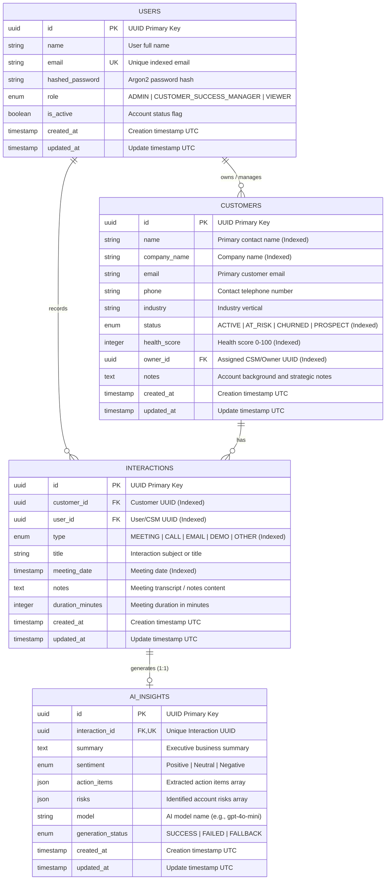

# Database Architecture & Entity-Relationship Diagram

This document describes the normalized PostgreSQL relational database schema for the **AI-Powered Customer Success Platform**.

---

## 1. Entity-Relationship (ER) Diagram

---

## 2. Table Specifications & Constraints

### 2.1 Table: `users`
* **Primary Key**: `id` (UUIDv4)
* **Unique Constraints**: `email` (Case-insensitive, indexed)
* **Check Constraints**: `is_active IN (true, false)`
* **Foreign Keys**: None (Parent root entity)

### 2.2 Table: `customers`
* **Primary Key**: `id` (UUIDv4)
* **Foreign Keys**:
  * `owner_id` &rarr; `users.id` (`ON DELETE SET NULL`)
* **Check Constraints**:
  * `check_health_score_range`: `health_score >= 0 AND health_score <= 100`
* **Indexes**:
  * `ix_customers_name` on `name`
  * `ix_customers_company_name` on `company_name`
  * `ix_customers_status` on `status`
  * `ix_customers_health_score` on `health_score`
  * `ix_customers_owner_id` on `owner_id`

### 2.3 Table: `interactions`
* **Primary Key**: `id` (UUIDv4)
* **Foreign Keys**:
  * `customer_id` &rarr; `customers.id` (`ON DELETE CASCADE`)
  * `user_id` &rarr; `users.id` (`ON DELETE SET NULL`)
* **Indexes**:
  * `ix_interactions_customer_id` on `customer_id`
  * `ix_interactions_user_id` on `user_id`
  * `ix_interactions_meeting_date` on `meeting_date`
  * `ix_interactions_type` on `type`

### 2.4 Table: `ai_insights`
* **Primary Key**: `id` (UUIDv4)
* **Foreign Keys**:
  * `interaction_id` &rarr; `interactions.id` (`ON DELETE CASCADE`, Unique 1:1 relationship)
* **Indexes**:
  * `ix_ai_insights_interaction_id` on `interaction_id` (Unique)
